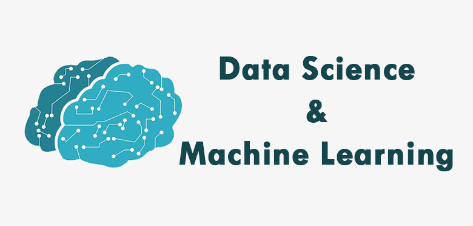

# Data Science and Machine Learning

## Overview

In this course, we explore various machine learning algorithms for supervised, unsupervised, and reinforcement learning. The implementations range from scratch to utilizing state-of-the-art libraries such as Scikit-Learn, Keras, and TensorFlow.

## Introduction to Machine Learning and Data Science

### Data Science
Data science involves the study of data, its structure, and analysis using statistical and computational techniques to extract meaningful insights. Tasks include data cleaning, visualization, and statistical modeling.

### Machine Learning
Machine learning, a subset of artificial intelligence, focuses on training machines to learn patterns and make predictions based on data. It entails developing algorithms that improve their performance over time. Applications include image recognition, natural language processing, and predictive modeling.

### Machine Learning and Data Science Together
Data scientists use machine learning as a tool to extract insights and identify patterns in large datasets, forming a powerful combination for solving complex problems and making data-driven decisions.

## Content

### Supervised Learning

- Perceptron
- Gradient Descent
- Linear Regression
- Logistic Regression
- Deep Neural Network
- K-Nearest Neighbors
- Decision Trees
- Ensemble Learning 
- Support Vector Machines

### Unsupervised Learning

- K-Means Clustering
- Principal Component Analysis

### Reinforcement Learning

- Q Learning
- Deep Reinforcement Learning

## Datasets

All datasets used in this work are publicly available. The source and description of each dataset used are provided within the respective model.

## Tools and Packages

- Python
- Visual Studio Code
- Jupyter Notebooks
- Scikit-learn
- TensorFlow
- Keras
- Matplotlib
- Numpy
- Pandas
- Seaborn

## About the Author

**Rohitaa Ravikumar**
- Graduate student in the department of Electrical and Computer Engineering at Rice University.
