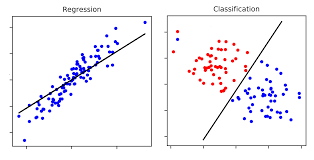

### Supervised Learning 

Supervised learning is a machine learning paradigm where the algorithm is trained on a labeled dataset, meaning that each input data point is associated with a corresponding output label. The goal is for the algorithm to learn a mapping from inputs to outputs, enabling it to make predictions or classifications on new, unseen data.

#### Classification

**Definition:** Classification is a type of supervised learning where the algorithm learns to categorize input data into predefined classes or labels.

**Mathematical Explanation:**
In classification, the algorithm aims to find a decision boundary that separates different classes in the feature space. The decision boundary is typically represented by a hyperplane, and the goal is to assign each input data point to a specific class based on its features.

One common mathematical representation is the linear equation for a decision boundary in a two-dimensional space:

f(x) = w_1x_1 + w_2x_2 + b

- f(x) is the decision function,
- x_1 and x_2 are the input features,
- w_1 and w_2 are the weights, and
- b is the bias term.

The algorithm learns the optimal values for w and b during training to achieve accurate classifications.

#### Regression

**Definition:** Regression is another type of supervised learning where the algorithm predicts a continuous output value instead of assigning a label to input data.

**Mathematical Explanation:**
In regression, the algorithm aims to learn a mapping from input features to a continuous output variable. A common mathematical representation for a linear regression model in a simple one-dimensional space is:

f(x) = wx + b

- f(x) is the predicted output,
- x is the input feature,
- w is the weight, and
- b is the bias term.

The algorithm adjusts the values of w and b during training to minimize the difference between predicted and actual output values.

# Supervised Learning Overview

This repository contains code and resources for implementing and understanding various supervised learning algorithms. The focus is on model building, error analysis, and practical applications of the following algorithms:

## Table of Contents
- **Perceptron**
- **Linear Regression**
- **Gradient Descent**
- **Logistic Regression**
- **K-Nearest Neighbors**
- **Neural Network**
- **Support Vector Machines**
- **Decision Trees**
- **Ensemble Learning**

